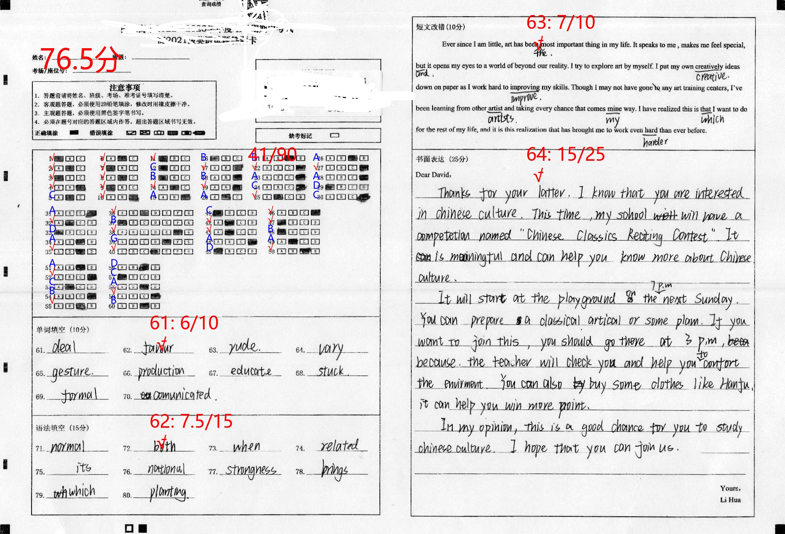

## Document OCR

This project is for scan the handwritten document, and transform them into text files. By using the latest deep learning models (**CRAFT** for text detection, **TROCR** for OCR transformation). This combinations can achieve very accurate results than other methods. Especially, the transformer OCR could both care about the individual word form but also the context information in the visual representation which can result better results than other methods. Related information, please read their papers()

## The normal steps to do document ocr

The single OCR model cannot automatically convert a whole page of text image into the text forms. That's not the way normal ocr model work. Usually, because of trainning limitation, the model can only convert **one word** or **one line of words** into its' text forms. So, before we want to do a whole page of document ocr, we need to **detect the location of the word** or **the location of the whole line words**.

### FIRST STEP, measure and crop page
So, the first step is to detect word location, here we use **CRAFT-pytorch** project, which is a word detection project, it can do one single word location detection and with their **refiner model** to detect a line of words(But, it is not very good perfermance in line text detection).

*Here is one example document under processing*

Although you can see, when we have some normal page, there still have some unwanted part in a page, so we can use some tools to crop the page. You can use `./utils/image_measure.py` to measure the point pixel position, and later use `./utils/image_crop.py` to crop the image.

*After croped the image, we have the interest part we care as follow.*

If all your images in a folder have a similiar layout, you can use the `process_folder` function to process them all. However this maybe can be done with some other deep learning model with layout guessing ability(TODO).

### SECOND STEP, detect the word in document

